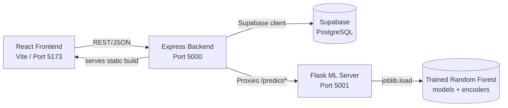

# 🌾 AgroInOne

**A full-stack agricultural platform that brings a crop marketplace, government schemes, farmer support, and AI-powered predictions together in one place.**


 ## [Deployment Link](https://agroinone-main.onrender.com/)


---

## Table of Contents

- [About the Project](#about-the-project)
- [Key Features](#key-features)
- [Tech Stack](#tech-stack)
- [Architecture](#architecture)
- [Project Structure](#project-structure)
- [Getting Started](#getting-started)
  - [Prerequisites](#prerequisites)
  - [Installation](#installation)
  - [Environment Variables](#environment-variables)
  - [Database Seeding](#database-seeding)
  - [Training the ML Models](#training-the-ml-models)
  - [Running Locally](#running-locally)
- [API Reference](#api-reference)
- [Testing](#testing)
- [Building for Production](#building-for-production)
- [Docker Support](#docker-support)
- [Known Limitations & Roadmap](#known-limitations--roadmap)
- [Contributing](#contributing)


---

## About the Project

**AgroInOne** is a full-stack web application built to support farmers and agricultural stakeholders through a single, unified platform. It combines a produce marketplace, a government schemes directory, a farmer helpdesk, and machine-learning-backed prediction tools (crop yield and loan approval) into one cohesive experience.

The project follows a **three-tier architecture**:
1. A **React (Vite)** single-page frontend
2. A **Node.js/Express** backend API, backed by **Supabase (PostgreSQL)**, handling auth, orders, products, schemes, and helpdesk data
3. A **Python/Flask** microservice serving two trained **scikit-learn** models for crop yield and loan approval prediction

---

## Key Features

### 🛒 Marketplace & Shop
- Product catalog (Grains, Nuts, Oil) served live from Supabase, with category browsing and detail pages
- Add-to-cart flow backed by local storage, with quantity management
- Checkout flow that collects shipping details and submits authenticated orders
- **Server-side price verification** — the backend re-looks-up real prices from the database when an order is placed, so a tampered client request can't check out at a fake price
- Order history page (`/orders`) for logged-in users
- A separate, static "shops near you" directory listing local sellers

### 📜 Government Schemes
- Searchable, state-filterable directory of official government schemes, served from Supabase
- Dynamically derives the list of states from the scheme dataset
- Falls back to "All India" schemes when no state is selected

### 🤖 AI-Powered Predictions
- **Crop Yield Prediction** — a trained Random Forest **Regressor** predicts production (tonnes) from state, district, crop, season, year, and area, and derives yield (tonnes/hectare)
- **Loan Approval Prediction** — a trained Random Forest **Classifier** predicts approval and probability from 11 applicant features (income, co-applicant income, loan amount/term, credit history, dependents, etc.)
- Both models are trained offline and loaded via `joblib`; the frontend never talks to the ML service directly — the backend proxies both requests

### 🆘 Helpdesk
- Searchable knowledge base served from Supabase, with live filtering across titles, descriptions, and state
- Contact details and reference links surfaced per article

### 🔐 Authentication & Accounts
- Email/password registration and login using JWT, with user records stored in Supabase
- Passwords hashed with `bcryptjs`
- Protected routes on both the frontend (`ProtectedRoute`) and backend (`authMiddleware`)
- Backend **refuses to start in production** if `JWT_SECRET` is missing or left at the insecure development default

---

## Tech Stack

| Layer | Technology |
|---|---|
| **Frontend** | React 18, Vite, React Router v6, React-Bootstrap, Bootstrap 5, React Toastify, FontAwesome |
| **Backend** | Node.js, Express, `@supabase/supabase-js`, JWT (`jsonwebtoken`), `bcryptjs`, `axios`, `cors`, `dotenv`, `ws` |
| **Database** | Supabase (managed PostgreSQL) — `users`, `orders`, `products`, `schemes`, `helpdesk` tables |
| **ML Server** | Python, Flask, Flask-CORS, scikit-learn (Random Forest), pandas, joblib, gunicorn (production WSGI) |

> **Note:** `@react-google-maps/api` and `google-map-react` are listed as frontend dependencies but are not yet wired into any component — the "shops near you" marketplace page still renders from a static JSON file rather than an interactive map.

---

## Architecture



- The **frontend** never talks to Supabase or the ML server directly — everything goes through the Express backend.
- On boot, the backend **seeds** the `products`, `schemes`, and `helpdesk` tables in Supabase from local JSON snapshots (each seeder is a no-op if the table already has rows), so the database is self-populating on first run.
- The **ML server** is fully decoupled: `app.py` only loads pre-trained `.joblib` models — it never trains on request. Training happens offline via the scripts described below.
- The **backend** serves the compiled frontend from `frontend/dist` and falls back to `index.html` for client-side routing (SPA fallback).

---

## Project Structure

```
AgroInOne/
├── backend/
│   ├── auth.js              # Registration, login, JWT auth middleware (Supabase-backed)
│   ├── db.js                # Supabase client, order queries, table seeders
│   ├── index.js             # Express app, routes, DB seeding on boot, ML proxy, SPA fallback
│   ├── package.json
│   ├── test_integration.js  # End-to-end auth + prediction script
│   ├── test_smoke.js        # Quick health-check script
│   └── data/                # (required, not committed) products/schemes/helpdesk JSON snapshots
│                             # + state/district/crop/season.json generated by clean_data.py
│
├── frontend/
│   ├── package.json
│   └── src/
│       ├── api/              # axiosConfig (products/orders/schemes/helpdesk services), predictcrop, predictloan
│       ├── components/       # Navbar, AuthModal, Helpdesk, Schemes, Predict, buy/ (shop), marketplace/
│       ├── context/          # AuthContext (login/logout/session)
│       ├── routes/           # Page-level route components (Home, Shop, Predict, Orders, etc.)
│       ├── App.jsx           # Route definitions
│       └── main.jsx          # App entry point
│
└── ml-server/
    ├── app.py                 # Flask app: loads trained models, serves /predict/crop, /predict/loan
    ├── clean_data.py          # Cleans raw Kaggle CSV → crop_data.csv + backend/data/*.json vocab
    ├── train_crop_model.py    # Trains the Random Forest Regressor (crop yield)
    ├── train_loan_model.py    # Generates synthetic data, trains the Random Forest Classifier (loan)
    ├── models/                 # (generated) *.joblib model + encoder files
    ├── Dockerfile              # Production image, runs via gunicorn as a non-root user
    ├── requirements.txt
    └── README.md
```

---

## Getting Started

### Prerequisites

- **Node.js** v18+ and npm
- **Python** 3.10+ and pip
- Git
- A free [Supabase](https://supabase.com) account and project, with `users`, `orders`, `products`, `schemes`, and `helpdesk` tables set up to match the shapes used in `backend/db.js` / `backend/index.js`

### Installation

Clone the repository and install dependencies for each service:

```bash
git clone https://github.com/yourusername/AgroInOne.git
cd AgroInOne

# Backend
cd backend
npm install

# Frontend
cd ../frontend
npm install

# ML Server
cd ../ml-server
python -m venv .venv
source .venv/bin/activate     # On Windows: .venv\Scripts\activate
pip install -r requirements.txt
```

### Environment Variables

| Service | Variable | Default | Description |
|---|---|---|---|
| Backend | `PORT` | `5000` | Port the Express server listens on |
| Backend | `JWT_SECRET` | `dev-secret` (dev only) | Secret used to sign JWTs. **Required in production** — the server exits on boot if it's missing or still set to `dev-secret` |
| Backend | `ML_SERVER_URL` | `http://localhost:5001` | Base URL of the Flask ML server |
| Backend | `SUPABASE_URL` | — | **Required.** Your Supabase project URL — the backend exits on boot without it |
| Backend | `SUPABASE_KEY` | — | **Required.** Your Supabase API key (anon or service key, depending on your RLS setup) |
| Frontend | `VITE_API_URL` | `/api` | Base URL the frontend uses for API calls. Leave as `/api` for same-origin production deployments, or point it at `http://localhost:5000/api` for local dev against a separately-hosted backend |

```env
# backend/.env
PORT=5000
JWT_SECRET=replace-with-a-strong-secret
ML_SERVER_URL=http://localhost:5001
SUPABASE_URL=https://your-project-ref.supabase.co
SUPABASE_KEY=your-supabase-anon-key
```

```env
# frontend/.env
VITE_API_URL=http://localhost:5000/api
```

### Database Seeding

The backend automatically seeds the `products`, `schemes`, and `helpdesk` Supabase tables from JSON snapshots in `backend/data/` the first time it boots (each seeder skips itself if the table already has rows). You'll need to provide:

| File | Seeds table | Used by |
|---|---|---|
| `products.json` | `products` | `GET /api/products`, shop/marketplace |
| `govt_schemes.json` | `schemes` | `GET /api/schemes` |
| `helpdesk_data.json` | `helpdesk` | `GET /api/helpdesk` |

These files are **not included in the repository** and must be created/sourced before the first backend run. If they're missing, `loadJsonArray()` falls back to an empty array, so the backend won't crash — the relevant feature will just seed nothing.

### Training the ML Models

The `state.json` / `district.json` / `crop.json` / `season.json` dropdown files used by the Crop Yield Prediction form are **generated from the training data**, not hand-written — and the ML models themselves must be trained before `app.py` can serve real predictions.

1. **Get the raw dataset.** Download the *"Crop Production in India"* dataset from Kaggle and place it as `ml-server/raw_crop_production.csv`. `clean_data.py` will fail with a clear error if this file isn't present.
2. **Clean it and generate dropdown vocab:**
   ```bash
   cd ml-server
   python clean_data.py
   ```
   This produces `crop_data.csv` and writes `state.json`, `district.json`, `crop.json`, and `season.json` directly into `backend/data/` — so the backend and the trained model always agree on valid values.
3. **Train the crop yield model** (Random Forest Regressor, saved to `models/crop_model_v1.joblib` + `models/crop_encoders.joblib`):
   ```bash
   python train_crop_model.py
   ```
4. **Train the loan approval model** (generates 5,000 synthetic applications, Random Forest Classifier, saved to `models/loan_model_v1.joblib` + `models/loan_encoders.joblib`):
   ```bash
   python train_loan_model.py
   ```

If `app.py` starts and either `.joblib` pair is missing, it logs a warning and the corresponding `/predict/*` endpoint returns a `500` until you run the matching training script.

### Running Locally

Start all three services in separate terminals:

```bash
# Terminal 1 — ML server
cd ml-server
source .venv/bin/activate
python app.py              # runs on http://localhost:5001

# Terminal 2 — Backend
cd backend
npm run dev                 # runs on http://localhost:5000 (nodemon)

# Terminal 3 — Frontend
cd frontend
npm run dev                 # runs on http://localhost:5173 (Vite)
```

Open `http://localhost:5173` in your browser.

---

## API Reference

### Backend — `http://localhost:5000/api`

| Method | Endpoint | Auth | Description |
|---|---|---|---|
| POST | `/auth/register` | — | Register a new user |
| POST | `/auth/login` | — | Log in and receive a JWT |
| GET | `/auth/profile` | ✅ | Get the logged-in user's profile |
| GET | `/me` | ✅ | Get current authenticated user (alt. endpoint) |
| GET | `/products` | — | List all products, served from Supabase |
| GET | `/products/:id` | — | Get details for a single product |
| GET | `/schemes?state=` | — | Get government schemes, optionally filtered by state |
| GET | `/helpdesk` | — | Retrieve all helpdesk articles |
| GET | `/predict/options` | — | Get dropdown vocab (state/district/crop/season) generated by `clean_data.py` |
| POST | `/predict/crop` | — | Proxies to the ML server's crop yield model |
| POST | `/predict/loan` | — | Proxies to the ML server's loan approval model |
| POST | `/orders` | ✅ | Create an order — prices are re-verified server-side against Supabase, ignoring client-sent values |
| GET | `/orders/my` | ✅ | Get the logged-in user's order history |
| GET | `/health`, `/api/health` | — | Health check |

### ML Server — `http://localhost:5001`

| Method | Endpoint | Description |
|---|---|---|
| POST | `/predict/crop` | Returns predicted `production` (tonnes) and derived `answer` (yield, tonnes/hectare) from the trained Random Forest Regressor |
| POST | `/predict/loan` | Returns `approved` (bool) and `probability` from the trained Random Forest Classifier |
| GET | `/health` | Health check |

---

## Testing

The backend includes two lightweight Node scripts (not a formal test framework) for manually verifying the system end-to-end. Run them **after** starting the backend and ML server:

```bash
cd backend

# Verifies both services are up and a prediction call succeeds
node test_smoke.js

# Walks through register → login → protected route → prediction
node test_integration.js
```

The frontend includes `@testing-library/react`, `@testing-library/jest-dom`, and `@testing-library/user-event` as dependencies, ready to be used for component-level tests.

---

## Building for Production

```bash
cd frontend
npm run build
```

The Express backend (`backend/index.js`) is pre-configured to serve the frontend's static assets directly from `frontend/dist` and falls back to `index.html` for client-side routes — no manual copy step needed.

To run the production server:

```bash
cd backend
npm start
```

---

## Docker Support

The ML server includes a production-ready Dockerfile that runs via **gunicorn** as a non-root user:

```bash
cd ml-server
docker build -t agroinone-ml .
docker run -p 5001:5001 agroinone-ml
```

> Remember to run the training scripts (or copy pre-trained `.joblib` files into `ml-server/models/`) before building the image — `app.py` doesn't train models on its own.

The backend and frontend do not yet include Dockerfiles — containerizing them following a similar pattern is a natural next step for full-stack deployment.

---

## Known Limitations & Roadmap

This section is included for transparency so contributors know what's production-ready versus what's still a work in progress:

- **The "shops near you" marketplace directory is still static.** Unlike products, schemes, and helpdesk, it's sourced from a local `placeDetails.json`, not Supabase.
- **Google Maps dependencies are unused.** `@react-google-maps/api` and `google-map-react` are installed but not yet integrated into the marketplace UI.
- **Cart storage is local-only.** The shopping cart is persisted in `localStorage`/`sessionStorage`, so it won't sync across devices or browsers.
- **The loan model is trained on synthetic data.** `train_loan_model.py` generates 5,000 artificial loan applications with a hand-designed approval rule for the model to learn from — it isn't trained on real historical lending data, so treat its output as a demo rather than a credit decisioning tool.


---

## Contributing

Contributions are welcome! To contribute:

1. Fork the repository
2. Create a feature branch (`git checkout -b feature/AmazingFeature`)
3. Commit your changes (`git commit -m 'Add some AmazingFeature'`)
4. Push to the branch (`git push origin feature/AmazingFeature`)
5. Open a Pull Request

Please open an issue first for major changes so we can discuss the approach.

---


