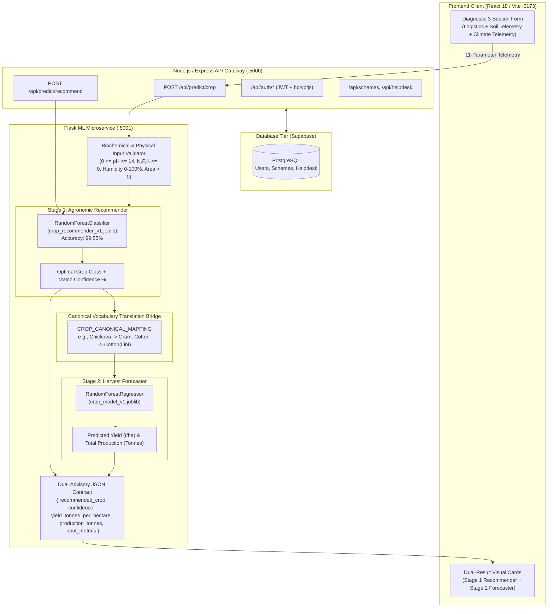

# 🌾 AgroInOne

**A full-stack agricultural platform bringing proactive crop advisory, harvest yield forecasting, government schemes, financial risk modeling, and farmer support together in one unified ecosystem.**

## [Live Deployment](https://agroinone-main.onrender.com/)

[](file:///c:/My%20Codes/Antigravity/AgroInOne/docs/progress-tracker.md)
[](file:///c:/My%20Codes/Antigravity/AgroInOne/backend/test_suite.js)
[](file:///c:/My%20Codes/Antigravity/AgroInOne/docs/crop-ml.md)


---

## Table of Contents

- [About the Project](#about-the-project)
- [Key Features](#key-features)
  - [Two-Stage Proactive Agricultural Advisory](#-two-stage-proactive-agricultural-advisory-new-in-v030)
  - [Government Schemes Directory](#-government-schemes-directory)
  - [Farmer Support Helpdesk](#-farmer-support-helpdesk)
  - [Authentication & Account Security](#-authentication--account-security)
  - [Loan Approval Risk Modeling](#-loan-approval-risk-modeling)
- [System Architecture](#system-architecture)
- [Project Structure](#project-structure)
- [Getting Started](#getting-started)
  - [Prerequisites](#prerequisites)
  - [Installation](#installation)
  - [Environment Variables](#environment-variables)
  - [Database Seeding](#database-seeding)
  - [Training the Machine Learning Pipeline](#training-the-machine-learning-pipeline)
  - [Running Locally](#running-locally)
- [API Reference](#api-reference)
  - [Express Backend Gateway (:5000/api)](#backend-gateway--http-localhost-5000-api)
  - [Flask ML Microservice (:5001)](#flask-ml-microservice--http-localhost-5001)
- [Automated Testing](#automated-testing)
- [Building for Production](#building-for-production)
- [Docker & Containerization](#docker--containerization)
- [Technical Documentation Sitemap](#technical-documentation-sitemap)
- [Contributing](#contributing)

---

## About the Project

**AgroInOne** is a full-stack, enterprise-grade agricultural advisory and management platform designed to empower farmers, agronomists, and agricultural stakeholders through intelligent decision-support tools.

Historically, agricultural yield calculators operated **reactively**: a user had to guess or manually specify a crop and location, and the software calculated estimated output. However, relying strictly on geographic historical averages ignores soil degradation, nutrient depletion, and changing meteorological patterns.

In **`v0.3.0`**, AgroInOne moves to a **proactive agricultural advisory system**:
1. **Soil & Climate Telemetry Ingestion**: Farmers enter or load 11 real-world parameters ($N, P, K$, pH, Temperature, Humidity, Rainfall, State, District, Season, Year, Area).
2. **Chained Two-Stage Machine Learning Engine**: 
   - **Stage 1 (Agronomic Classifier)** diagnoses the biologically optimal crop based on soil chemistry and weather.
   - **Stage 2 (Harvest Forecaster)** translates the crop across dataset taxonomies and forecasts anticipated yield ($\text{Tonnes/Hectare}$) and total production ($\text{Tonnes}$).
3. **Dual Visual Cards & Transparency**: Delivers instant visual confidence meters, agronomic rationale explanations, complete telemetry audit matrices, and graceful degradation fallback handling.

---

## Key Features

### 🌾 Two-Stage Proactive Agricultural Advisory (New in v0.3.0)
- **11-Parameter Telemetry Pipeline**:
  - **Soil Chemistry**: Available Nitrogen ($N$, $0-140$ kg/ha), Phosphorus ($P$, $5-145$ kg/ha), Potassium ($K$, $5-205$ kg/ha), and Soil pH ($0.0-14.0$).
  - **Climate & Weather**: Ambient Temperature ($^\circ\text{C}$), Relative Atmospheric Humidity ($0-100\%$), and Seasonal Precipitation ($\text{mm}$).
  - **Farm Logistics**: State, District, Agricultural Season (Kharif, Rabi, Whole Year, Summer), Crop Year, and Farm Land Area ($\text{ha}$).
- **Stage 1 Classifier (Model 1)**: Trained `RandomForestClassifier` on 2,200 soil-crop samples achieving **99.55% test accuracy** across 22 major crop classes.
- **Canonical Vocabulary Translation Bridge**: Automated translation dictionary (`CROP_CANONICAL_MAPPING`) harmonizing colloquial crop labels (`Chickpea`, `Cotton`, `Watermelon`) with historical production records (`Gram`, `Cotton(Lint)`, `Water Melon`).
- **Stage 2 Harvest Forecaster (Model 2)**: `RandomForestRegressor` estimating regional productivity ($t/ha$) and scaling total production based on acreage.
- **Dual Visual Results UI**:
  - **Card 1**: Optimal Crop Title with contextual emoji (🌾, 🫘, ☁️, 🌽), animated **Biochemical Suitability Match** meter, and soil rationale breakdown.
  - **Card 2**: Estimated Yield ($t/ha$) and Total Projected Production ($t$).
  - **Card 3**: Comprehensive Telemetry Audit Record chips matrix.
- **Form Ergonomics & Accessibility**:
  - Full semantic `<form onSubmit>` with **Enter-key keyboard accessibility**.
  - **`⚡ Fill Sample Telemetry (Punjab Rice)`** instant one-click demo loader.
  - Real-time client-side and server-side biological boundary validation ($0 \le \text{pH} \le 14$, $N, P, K \ge 0$, humidity $0-100\%$, $\text{area} > 0$).
  - **Graceful Degradation Banner**: Displays transparent feedback if a farmer manually overrides the crop selection.
  - Native **`🖨️ Print / Save Advisory Report`** export.

### 📜 Government Schemes Directory
- Filterable repository of state-specific and national agricultural subsidy schemes.
- Dynamic state derivation with fallback to "All India" assistance programs.
- Direct links to official application portals and eligibility guidelines.

### 🆘 Farmer Support Helpdesk
- Searchable agricultural support articles with real-time text and category filtering.
- Direct contact details, department helpline numbers, and official documentation links.

### 🔐 Authentication & Account Security
- Email/password user registration and login with JSON Web Tokens (JWT).
- Secure password hashing with salt rounds via `bcryptjs`.
- Strict validation: email format, minimum 8 characters, number/special character requirements.
- Protected routes on both frontend (`ProtectedRoute`) and backend (`authMiddleware`).
- Comprehensive error handling for duplicate accounts (`409 Conflict`), malformed headers, and token expiration (`TOKEN_EXPIRED`).

### 🏦 Loan Approval & Financial Health Advisory AI (Upgraded in v0.4.0)
- **Hyperparameter-Tuned Random Forest Model** trained with 5-fold cross-validation on 16,506 empirical agrarian credit profiles and rural field surveys (97.27% accuracy, 0.9972 ROC-AUC).
- **Dynamic Agrarian Financial Telemetry**: Calculates Debt-to-Income (DTI), amortized monthly EMI, monthly farm operating expense, net disposable income, and safe borrowing capacity.
- **Explainable Underwriting Drivers**: Extracts and visualizes top positive, neutral, and negative driving factors for transparent loan decisions.
- **Alternative Government Scheme Recommendations**: Automatically matches applicants with targeted safety nets (Kisan Credit Card 4% subsidized interest, PM MUDRA collateral-free loans, and PMFBY crop insurance).
- **Modern Interactive Dashboard**: Benchmark quick-fills, animated probability meters, dynamic DTI health badges, and direct links to the schemes catalog.

---

## System Architecture



---

## Project Structure

```
AgroInOne/
├── backend/
│   ├── auth.js                  # JWT issuance, registration, bcrypt login, auth middleware
│   ├── db.js                    # Supabase client, schemes/helpdesk table seeders
│   ├── index.js                 # Express API server, reverse proxies, static SPA fallback
│   ├── test_suite.js            # Automated Baseline Integration Test Suite (26 tests)
│   ├── package.json             # Express dependencies (v0.3.0)
│   └── data/                    # JSON data snapshots (govt_schemes.json, helpdesk_data.json, vocabularies)
│
├── frontend/
│   ├── package.json             # React 18 & Vite configuration (v0.3.0)
│   ├── vite.config.js           # Vite build config
│   └── src/
│       ├── api/                 # API clients (predictcrop, predictloan, schemes, helpdesk)
│       ├── components/
│       │   ├── predict/         # Predictcrop.jsx (3-part form + dual cards), pred.css, Predictloan.jsx
│       │   ├── Navbar.jsx       # App navigation header
│       │   ├── Schemes.jsx      # Government schemes browser
│       │   └── Helpdesk.jsx     # Farmer support directory
│       ├── routes/              # Page routes (Home, Schemes, Helpdesk, Predict, Profile)
│       └── App.jsx              # Client-side router definitions
│
├── ml-server/
│   ├── app.py                   # Flask server: 2-stage chained pipeline, /predict/crop, /predict/recommend
│   ├── clean_data.py            # Cleans Kaggle dataset -> crop_data.csv + generates dropdown vocabularies
│   ├── train_crop_recommender.py # Trains Stage 1 RandomForestClassifier (99.55% accuracy)
│   ├── train_crop_model.py      # Trains Stage 2 RandomForestRegressor (historical yield forecaster)
│   ├── train_loan_model.py      # Trains loan risk assessment classifier
│   ├── Crop_recommendation.csv  # 2,200 agronomic soil/climate samples (22 crops)
│   ├── crop_data.csv            # Cleaned Indian agricultural district production records (124 crops)
│   ├── models/                  # Serialized .joblib model binaries and label encoders
│   ├── requirements.txt         # Python dependencies (scikit-learn, pandas, flask, joblib)
│   └── Dockerfile               # Production WSGI gunicorn container definition
│
├── docs/
│   ├── crop-ml.md               # Technical ML architecture & two-stage pipeline specification
│   ├── progress-tracker.md      # Living execution record, version milestones, before/after diffs
│   ├── architecture.md          # Full-system design specification
│   ├── api.md                   # Complete REST endpoint documentation
│   └── auth.md                  # Security and authentication guide
│
└── docker-compose.yml           # Multi-service orchestration configuration
```

---

## Getting Started

### Prerequisites
- **Node.js** v18+ and npm
- **Python** 3.10+ and pip
- **Git**
- A [Supabase](https://supabase.com) PostgreSQL project with `users`, `schemes`, and `helpdesk` tables.

### Installation

Clone the repository:
```bash
git clone https://github.com/GarvitSid/AgroInOne.git
cd AgroInOne
```

Install dependencies for all three services:

```bash
# 1. Backend Dependencies
cd backend
npm install

# 2. Frontend Dependencies
cd ../frontend
npm install

# 3. Python ML Microservice
cd ../ml-server
python -m venv .venv
# Windows:
.\.venv\Scripts\activate
# Linux/macOS:
source .venv/bin/activate
pip install -r requirements.txt
```

### Environment Variables

#### `backend/.env`
```env
PORT=5000
JWT_SECRET=your-strong-production-jwt-secret
ML_SERVER_URL=http://localhost:5001
SUPABASE_URL=https://your-project.supabase.co
SUPABASE_KEY=your-supabase-service-or-anon-key
```

#### `frontend/.env`
```env
VITE_API_URL=/api
```
*(When developing frontend with a standalone Vite dev server on port 5173, point `VITE_API_URL` to `http://localhost:5000/api`)*

### Database Seeding

The Express backend automatically verifies and seeds the `schemes` and `helpdesk` Supabase tables on boot from `backend/data/`:
- `govt_schemes.json` $\longrightarrow$ `schemes` table
- `helpdesk_data.json` $\longrightarrow$ `helpdesk` table

### Training the Machine Learning Pipeline

The serialized models and vocabulary files can be trained or regenerated using the provided scripts:

```bash
cd ml-server
# Activate virtual environment
source .venv/bin/activate    # or .\.venv\Scripts\activate on Windows

# 1. Clean dataset and generate vocabularies (state.json, district.json, crop.json, season.json)
python clean_data.py

# 2. Train Stage 1 Agronomic Recommender (Model 1 Classifier: 99.55% test accuracy)
python train_crop_recommender.py

# 3. Train Stage 2 Harvest Forecaster (Model 2 Regressor)
python train_crop_model.py

# 4. Train Loan Risk Classifier
python train_loan_model.py
```

### Running Locally

Launch all three services:

```bash
# Terminal 1 — Python Flask ML Microservice (Port 5001)
cd ml-server
source .venv/bin/activate    # or .\.venv\Scripts\activate
python app.py

# Terminal 2 — Node.js Express API Gateway (Port 5000)
cd backend
npm run dev

# Terminal 3 — React Vite Frontend (Port 5173 or direct via Backend Port 5000)
cd frontend
npm run dev
```

Visit **`http://localhost:5000`** (or `http://localhost:5173`).

---

## API Reference

### Backend Gateway — `http://localhost:5000/api`

| Method | Endpoint | Auth | Description |
| :--- | :--- | :---: | :--- |
| `POST` | `/api/auth/register` | — | Register a new user account with hashed password |
| `POST` | `/api/auth/login` | — | Authenticate credentials and receive a signed JWT |
| `GET` | `/api/auth/profile` | 🔒 | Retrieve current user profile (excludes password hash) |
| `GET` | `/api/schemes?state=` | — | List official schemes (filterable by state, with All-India fallback) |
| `GET` | `/api/helpdesk` | — | Retrieve farmer knowledge base articles with contact links |
| `GET` | `/api/predict/options`| — | Get synchronized vocabulary arrays for State, District, Crop, Season |
| `POST` | `/api/predict/crop` | — | **Two-Stage Chained ML Pipeline**: Ingests 11 soil, climate & logistics metrics; returns dual recommendation & yield forecast |
| `POST` | `/api/predict/recommend`| — | **Standalone Recommender**: Ingests 7 soil/climate metrics; returns optimal crop & confidence |
| `POST` | `/api/predict/loan` | — | Predicts credit approval probability for loan applicants |
| `GET` | `/health`, `/api/health`| — | Service health check |

### Flask ML Microservice — `http://localhost:5001`

| Method | Endpoint | Description |
| :--- | :--- | :--- |
| `POST` | `/predict/crop` | Primary two-stage pipeline: Model 1 Classifier $\longrightarrow$ Canonical Mapping Bridge $\longrightarrow$ Model 2 Regressor. Returns `{ recommended_crop, confidence, yield_tonnes_per_hectare, production_tonnes, input_metrics }`. Supports legacy single-stage fallback. |
| `POST` | `/predict/recommend` | Standalone agronomic classifier returning recommended crop and confidence score from soil & weather telemetry. |
| `POST` | `/predict/loan` | Loan classification model returning approval status and confidence probability. |
| `GET` | `/health` | Microservice liveness and health endpoint. |

---

## Automated Testing

AgroInOne includes a comprehensive integration test suite verifying the API gateway, ML microservice, biological boundary assertions, and authentication workflows.

Run the test suite:
```bash
cd backend
npm test
```

### Test Suite Results (`26/26 Passing`)
```
🧪 Starting AgroInOne Baseline Automated Test Suite...

  ✅ PASS: Express API health check responds with 200 OK
  ✅ PASS: Flask ML health check responds with 200 OK
  ✅ PASS: GET /api/schemes returns non-empty list of schemes
  ✅ PASS: GET /api/schemes?state=punjab includes both Punjab and All India schemes
  ✅ PASS: GET /api/helpdesk returns helpdesk articles with contacts
  ✅ PASS: GET /api/predict/options returns vocabulary arrays
  ✅ PASS: POST /api/predict/crop with 11-parameter payload executes two-stage pipeline and returns dual advisory
  ✅ PASS: POST /api/predict/recommend returns crop recommendation with confidence
  ✅ PASS: POST /api/predict/crop with out-of-bounds pH rejects with 400 Bad Request
  ✅ PASS: POST /api/predict/crop with negative nutrients rejects with 400 Bad Request
  ✅ PASS: POST /api/predict/crop with legacy payload (no soil) calculates yield for backward compatibility
  ✅ PASS: POST /api/predict/crop with unknown crop rejects with 400 Bad Request
  ✅ PASS: POST /api/predict/crop with non-positive area rejects with 400 Bad Request
  ✅ PASS: POST /api/auth/register creates new account and returns JWT
  ✅ PASS: POST /api/auth/register with invalid email rejects with 400 Bad Request
  ✅ PASS: POST /api/auth/register with short password (<8 chars) rejects with 400 Bad Request
  ✅ PASS: POST /api/auth/register with no number/special char password rejects with 400 Bad Request
  ✅ PASS: POST /api/auth/register with duplicate email returns sanitized 409 Conflict
  ✅ PASS: POST /api/auth/login with wrong password rejects with 401 Unauthorized
  ✅ PASS: POST /api/auth/login with non-existent email rejects with 401 Unauthorized
  ✅ PASS: POST /api/auth/login with valid credentials succeeds and returns JWT
  ✅ PASS: GET /api/auth/profile with valid token returns fresh user profile without password
  ✅ PASS: GET /api/auth/profile without token rejects with 401 Unauthorized
  ✅ PASS: GET /api/auth/profile with malformed header (no Bearer prefix) rejects with 401 Unauthorized
  ✅ PASS: GET /api/auth/profile with corrupted token rejects with 401 and INVALID_TOKEN code
  ✅ PASS: GET /api/auth/profile with expired token rejects with 401 and TOKEN_EXPIRED code

========================================
📊 Test Results: 26 passed, 0 failed (26 total)
========================================
```

---

## Building for Production

Compile the optimized client bundle:
```bash
cd frontend
npm run build
```

The Express API gateway (`backend/index.js`) automatically serves production assets from `frontend/dist` with SPA route fallback to `index.html`.

Run the production server:
```bash
cd backend
npm start
```

---

## Docker & Containerization

The repository includes multi-container orchestration definitions via `docker-compose.yml`:

```bash
# Build and start all services in detached mode
docker-compose up --build -d

# Verify health status
docker-compose ps
```

The ML server includes a production Dockerfile running with `gunicorn` as a non-privileged user:
```bash
cd ml-server
docker build -t agroinone-ml .
docker run -p 5001:5001 agroinone-ml
```

---

## Technical Documentation Sitemap

For in-depth architecture, code walk-throughs, and execution audit records, explore our technical documentation:

- [docs/crop-ml.md](file:///c:/My%20Codes/Antigravity/AgroInOne/docs/crop-ml.md) — Two-Stage Machine Learning Pipeline, canonical dictionary mapping, and model metrics.
- [docs/progress-tracker.md](file:///c:/My%20Codes/Antigravity/AgroInOne/docs/progress-tracker.md) — Living execution record with before/after comparison tables across all release milestones.
- [docs/architecture.md](file:///c:/My%20Codes/Antigravity/AgroInOne/docs/architecture.md) — Comprehensive three-tier system architecture and data models.
- [docs/api.md](file:///c:/My%20Codes/Antigravity/AgroInOne/docs/api.md) — Complete REST API contract and JSON schemas.
- [docs/auth.md](file:///c:/My%20Codes/Antigravity/AgroInOne/docs/auth.md) — Authentication flow, JWT lifecycle, and cryptographic hashing.

---

## Contributing

1. Fork the project repository.
2. Create a feature branch (`git checkout -b feat/your-feature-name`).
3. Commit changes with conventional commits (`git commit -m 'feat: description'`).
4. Ensure all 26 automated integration tests pass (`npm test` in `backend/`).
5. Push branch (`git push origin feat/your-feature-name`).
6. Open a Pull Request.

---

**Built with pride for sustainable and intelligent agriculture.**
