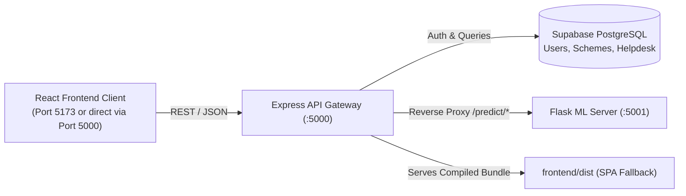

# 🌾 AgroInOne — Express API Gateway & Authentication Service

The core Node.js/Express backend gateway for AgroInOne, handling enterprise authentication, Supabase data persistence, database self-seeding, static SPA delivery, and reverse proxy routing to the Python ML microservice.

---

## 🛠️ Tech Stack & Dependencies

- **Runtime**: Node.js v18+ / v20
- **Framework**: Express 4.21
- **Database**: Supabase PostgreSQL (`@supabase/supabase-js`, `ws`)
- **Security & Cryptography**: JSON Web Tokens (`jsonwebtoken`), password hashing (`bcryptjs`)
- **HTTP Client**: `axios` (for upstream ML microservice reverse proxying)
- **Environment Management**: `dotenv`
- **Testing**: Built-in automated integration test suite (`test_suite.js`)

---

## 🏗️ Core Responsibilities



### 1. Reverse Proxy Gateway
- Forwarding client prediction requests to the decoupled Flask ML microservice:
  - `POST /api/predict/crop` $\longrightarrow$ `${ML_SERVER}/predict/crop` (Two-Stage advisory pipeline)
  - `POST /api/predict/recommend` $\longrightarrow$ `${ML_SERVER}/predict/recommend` (Standalone agronomic recommender)
  - `POST /api/predict/loan` $\longrightarrow$ `${ML_SERVER}/predict/loan` (Credit risk classifier)
- Preserves upstream HTTP status codes (`400 Bad Request`, `500 Server Error`) and surfaces structured error payloads.

### 2. Enterprise Authentication & Security
- User registration and authentication backed by Supabase `users` table.
- Passwords salted and hashed with `bcryptjs` before storage.
- Strict input validation: email format, minimum 8 characters, and alphanumeric/special symbol complexity.
- Protected route middleware (`authMiddleware`) verifying Bearer token headers.
- Standardized error codes:
  - `409 Conflict` on duplicate registration attempts
  - `401 Unauthorized` with `INVALID_TOKEN` or `TOKEN_EXPIRED` codes

### 3. Database Bootstrapping & Self-Seeding
- Automatic database verification on boot with exponential backoff retries (`bootDatabase()`).
- Self-seeds tables from local JSON snapshots if empty:
  - `govt_schemes.json` $\longrightarrow$ `schemes` table
  - `helpdesk_data.json` $\longrightarrow$ `helpdesk` table

### 4. Static Production Asset Serving
- Directly hosts compiled frontend assets from `../frontend/dist`.
- Implements wildcard SPA fallback (`*`) returning `index.html` for client-side routing.

---

## 📡 API Reference

| Method | Endpoint | Auth | Description |
| :--- | :--- | :---: | :--- |
| `POST` | `/api/auth/register` | — | Register account with email and password |
| `POST` | `/api/auth/login` | — | Log in and receive a signed JWT |
| `GET` | `/api/auth/profile` | 🔒 | Get authenticated user profile (password excluded) |
| `GET` | `/api/schemes?state=` | — | Retrieve government subsidy schemes (state-filterable) |
| `GET` | `/api/helpdesk` | — | Retrieve farmer knowledge base articles and contacts |
| `GET` | `/api/predict/options`| — | Retrieve vocabulary arrays (state, district, crop, season) |
| `POST` | `/api/predict/crop` | — | Proxy to two-stage crop advisory & yield prediction |
| `POST` | `/api/predict/recommend`| — | Proxy to isolated agronomic crop recommender |
| `POST` | `/api/predict/loan` | — | Proxy to loan risk evaluation model |
| `GET` | `/health`, `/api/health`| — | Health check endpoints |

---

## ⚙️ Environment Variables (`.env`)

Create a `.env` file in `backend/`:

```env
PORT=5000
JWT_SECRET=your-strong-production-jwt-secret
ML_SERVER_URL=http://localhost:5001
SUPABASE_URL=https://your-project.supabase.co
SUPABASE_KEY=your-supabase-service-or-anon-key
```

*Note: In production environments, the server safely aborts boot if `JWT_SECRET`, `SUPABASE_URL`, or `SUPABASE_KEY` are unset.*

---

## 🧪 Automated Testing

AgroInOne includes a formal automated integration test suite covering the entire API surface, authentication flows, error handlers, and ML proxies.

```bash
npm test
```

### Current Status: `26/26 Passing (100%)`
```
🧪 Starting AgroInOne Baseline Automated Test Suite...

  ✅ PASS: Express API health check responds with 200 OK
  ✅ PASS: Flask ML health check responds with 200 OK
  ✅ PASS: GET /api/schemes returns non-empty list of schemes
  ✅ PASS: GET /api/schemes?state=punjab includes both Punjab and All India schemes
  ✅ PASS: GET /api/helpdesk returns helpdesk articles with contacts
  ✅ PASS: GET /api/predict/options returns vocabulary arrays
  ✅ PASS: POST /api/predict/crop with 11-parameter payload executes two-stage pipeline and returns dual advisory
  ✅ PASS: POST /api/predict/recommend returns crop recommendation with confidence
  ✅ PASS: POST /api/predict/crop with out-of-bounds pH rejects with 400 Bad Request
  ✅ PASS: POST /api/predict/crop with negative nutrients rejects with 400 Bad Request
  ✅ PASS: POST /api/predict/crop with legacy payload (no soil) calculates yield for backward compatibility
  ✅ PASS: POST /api/predict/crop with unknown crop rejects with 400 Bad Request
  ✅ PASS: POST /api/predict/crop with non-positive area rejects with 400 Bad Request
  ✅ PASS: POST /api/auth/register creates new account and returns JWT
  ✅ PASS: POST /api/auth/register with invalid email rejects with 400 Bad Request
  ✅ PASS: POST /api/auth/register with short password (<8 chars) rejects with 400 Bad Request
  ✅ PASS: POST /api/auth/register with no number/special char password rejects with 400 Bad Request
  ✅ PASS: POST /api/auth/register with duplicate email returns sanitized 409 Conflict
  ✅ PASS: POST /api/auth/login with wrong password rejects with 401 Unauthorized
  ✅ PASS: POST /api/auth/login with non-existent email rejects with 401 Unauthorized
  ✅ PASS: POST /api/auth/login with valid credentials succeeds and returns JWT
  ✅ PASS: GET /api/auth/profile with valid token returns fresh user profile without password
  ✅ PASS: GET /api/auth/profile without token rejects with 401 Unauthorized
  ✅ PASS: GET /api/auth/profile with malformed header (no Bearer prefix) rejects with 401 Unauthorized
  ✅ PASS: GET /api/auth/profile with corrupted token rejects with 401 and INVALID_TOKEN code
  ✅ PASS: GET /api/auth/profile with expired token rejects with 401 and TOKEN_EXPIRED code

========================================
📊 Test Results: 26 passed, 0 failed (26 total)
========================================
```

---

## 🚀 Running the Server

```bash
# Install dependencies
npm install

# Start development server with hot-reload (nodemon)
npm run dev

# Start production server
npm start
```
