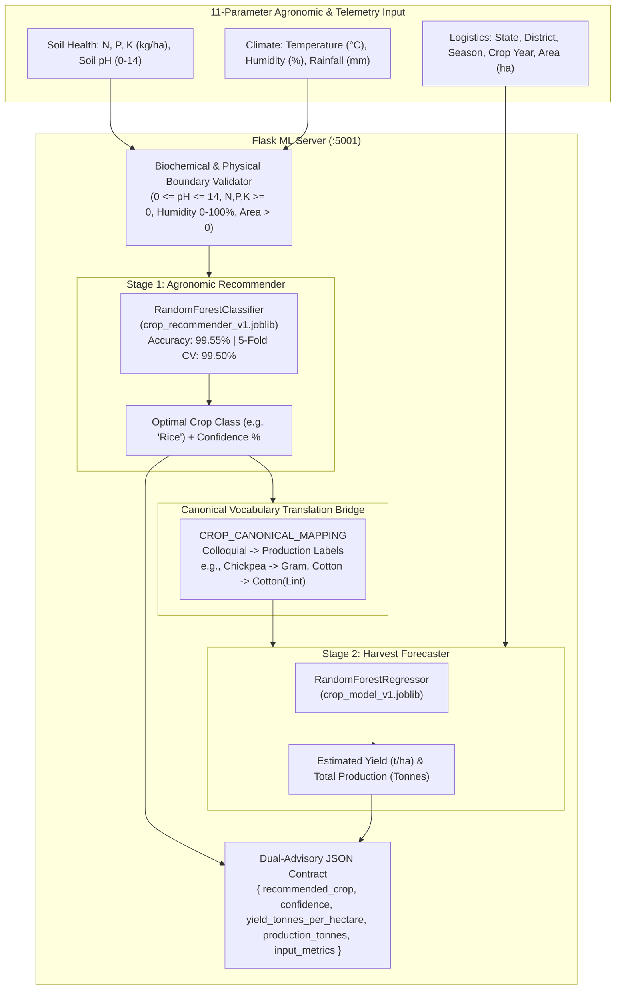

# 🌾 AgroInOne — Machine Learning Microservice

A high-performance Python microservice serving the **Two-Stage Chained Machine Learning Pipeline** for proactive crop recommendation, harvest yield forecasting, and agricultural credit risk modeling.

---

## 🛠️ Tech Stack & Dependencies

- **Language**: Python 3.10+
- **Web Microframework**: Flask 3.1, Flask-CORS
- **Machine Learning**: scikit-learn 1.9+, pandas, numpy, joblib
- **Production WSGI Server**: gunicorn

---

## 🧠 Machine Learning Architecture



### 1. Stage 1: Agronomic Crop Recommender (Classifier)
- **Model Binary**: `models/crop_recommender_v1.joblib` + `models/crop_recommender_meta.joblib`
- **Algorithm**: `RandomForestClassifier` (`n_estimators=100`, `max_depth=16`, `random_state=42`)
- **Dataset**: `Crop_recommendation.csv` (2,200 samples across 22 major crop categories)
- **Features (7 parameters)**: $N, P, K$ (ratios in kg/ha), soil pH ($0.0-14.0$), temperature ($^\circ\text{C}$), humidity ($\%$), rainfall ($\text{mm}$)
- **Performance**: **99.55% test accuracy**, **99.50% 5-fold cross-validation**

### 2. Canonical Vocabulary Translation Bridge
Translates colloquial recommendation classes into historical Indian production categories:
- `Chickpea` $\longrightarrow$ `Gram`
- `Cotton` $\longrightarrow$ `Cotton(Lint)`
- `Pomegranate` $\longrightarrow$ `Pome Granet`
- `Watermelon` $\longrightarrow$ `Water Melon`
- `Mungbean` $\longrightarrow$ `Moong(Green Gram)`
- `Pigeonpeas` $\longrightarrow$ `Arhar/Tur`
- `Kidneybeans` $\longrightarrow$ `Beans & Mutter(Vegetable)`
- `Mothbeans` $\longrightarrow$ `Other Cereals & Millets`

### 3. Stage 2: Harvest Forecaster (Regressor)
- **Model Binary**: `models/crop_model_v1.joblib` + `models/crop_encoders.joblib`
- **Algorithm**: `RandomForestRegressor`
- **Dataset**: `crop_data.csv` (cleaned historical Indian district-level agricultural production records across 124 crops)
- **Features**: One-hot encoded `State_Name`, `District_Name`, `Season`, `Crop` (derived from Stage 1 or manual override), plus numeric `Crop_Year` and `Area`
- **Outputs**: Estimated Yield ($\text{Tonnes/Hectare}$) and Total Production ($\text{Tonnes}$)

### 4. Loan Credit Risk & Financial Health Advisory AI (Classifier)
- **Model Binary**: `models/loan_model_rf.joblib` (and backward-compatible alias `loan_model_v1.joblib`) + `models/loan_encoders.joblib`
- **Algorithm**: `RandomForestClassifier` (`n_estimators=100`, `max_depth=16`, `min_samples_split=4`, `min_samples_leaf=2`, `class_weight='balanced'`)
- **Dataset**: `agro_loan_master.csv` (16,506 empirical rural profiles and field surveys)
- **Performance**: Accuracy **97.27%**, Precision **0.9725**, Recall **0.9847**, F1 Score **0.9786**, ROC-AUC **0.9972**
- **Telemetry & Explainability**: Calculates Debt-to-Income (DTI), amortized monthly EMI, net disposable income, safe borrowing limits, top driving factors, and alternative government scheme recommendations (KCC, MUDRA, PMFBY).

---

## 🛡️ Biological & Physical Boundary Enforcement

The service strictly validates real-world constraints, immediately returning `HTTP 400 Bad Request` on invalid data:
- **Soil pH**: $0.0 \le \text{pH} \le 14.0$
- **Soil Nutrients ($N, P, K$)**: $\ge 0$
- **Relative Humidity**: $0\% \le \text{humidity} \le 100\%$
- **Rainfall**: $\ge 0$
- **Farm Area**: $> 0$

---

## 📡 API Endpoints

### `POST /predict/crop`
Primary two-stage pipeline. Ingests 11 soil, weather, and logistics parameters and returns the dual recommendation + yield forecast. Also supports legacy single-stage requests (providing `selected_crop` without soil telemetry) for 100% backward compatibility.

**Request Body**:
```json
{
  "N": 90,
  "P": 42,
  "K": 43,
  "ph": 6.5,
  "temperature": 20.88,
  "humidity": 82.0,
  "rainfall": 202.94,
  "selected_state": "Punjab",
  "selected_district": "Ludhiana",
  "selected_season": "Kharif",
  "crop_year": 2024,
  "area": 10
}
```

**Response (`200 OK`)**:
```json
{
  "recommended_crop": "Rice",
  "confidence": 0.9208,
  "yield_tonnes_per_hectare": 1.55,
  "production_tonnes": 15.52,
  "answer": 1.55,
  "production": 15.52,
  "input_metrics": { ... }
}
```

### `POST /predict/recommend`
Standalone Model 1 endpoint. Evaluates 7 soil and climate metrics to return the optimal crop and suitability confidence score.

**Request Body**:
```json
{
  "N": 40, "P": 60, "K": 80,
  "temperature": 18.0, "humidity": 16.0, "ph": 7.2, "rainfall": 75.0
}
```

**Response (`200 OK`)**:
```json
{
  "recommended_crop": "Chickpea",
  "confidence": 1.0,
  "input_metrics": { ... }
}
```

### `POST /predict/loan`
Credit risk classifier returning `approved` (boolean) and confidence `probability`.

### `GET /health`
Liveness probe returning `{"status": "ok"}`.

---

## 🚀 Setup & Execution

### 1. Installation
```bash
python -m venv .venv
# Windows:
.\.venv\Scripts\activate
# Linux/macOS:
source .venv/bin/activate

pip install -r requirements.txt
```

### 2. Training Pipelines
To train or retrain the models:
```bash
# Clean Kaggle dataset and generate dropdown vocabularies
python clean_data.py

# Train Stage 1 Agronomic Recommender (Model 1 Classifier - 99.55% accuracy)
python train_crop_recommender.py

# Train Stage 2 Harvest Forecaster (Model 2 Regressor)
python train_crop_model.py

# Train Loan Risk Classifier
python train_loan_model.py
```

### 3. Run Development Server
```bash
python app.py
```
*Listens on `http://localhost:5001`.*

### 4. Docker Production Build
```bash
docker build -t agroinone-ml .
docker run -p 5001:5001 agroinone-ml
```
*(Runs via `gunicorn` as a non-privileged user).*
